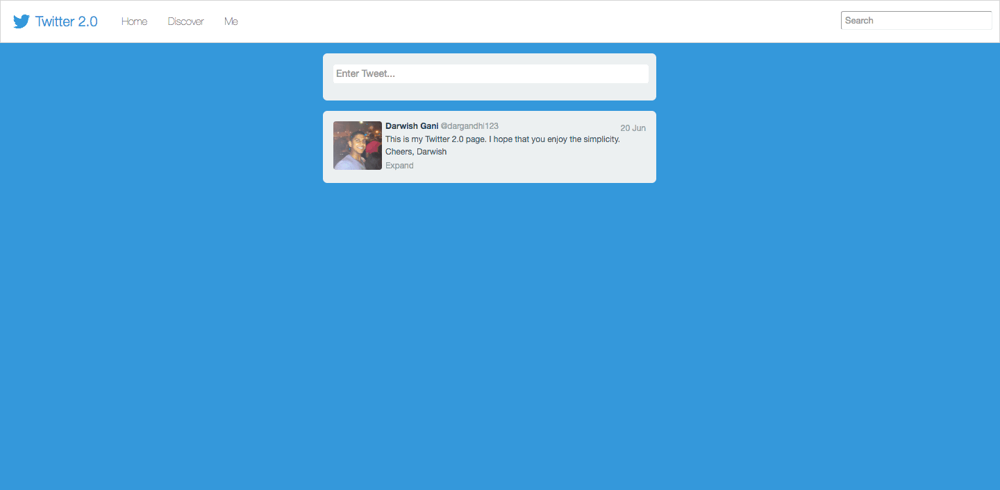
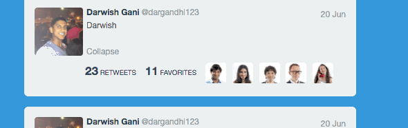

# Twitter-Front-End-Copy
Mimics a Twitter feed

Build a simplified single-page version of something like the Twitter Home page, which should:
- Have an input box + submit button at the top that allows a user to enter new status messages
- Upon submission, insert the latest message at the top of an area below the input box (the user should be able to enter as many messages as they want)
- Restrict the user input to 140 characters
- Show the user's avatar, message, timestamp, and a few action links (like Favorite and Reply) on each message - the timestamp and links don't have to do anything or be dynamic, they can just be styled text, and the avatar is obviously just static
- Be a single page with no back end refreshing the page obviously clears everything out
- Be styled as if you were going to deploy this to Twitter or Facebook pretend you're building this as if it would be shown on a live site immediately to millions of users. The interaction and design are an important parts of the exercise, since we're looking for product engineers that can build production-ready features
- The exercise is fairly open-ended as we want to get an idea of your ability to create something great
without always having detailed design input. Feel free to use any tools you want (jQuery, SASS, etc.), and it doesn't need to support IE or anything. The deliverable should be a zip file with the page and any assets.

The devil is also in the details:

